# Task E : Compliance and Supply Chain

The same flask webapp will be used for this task. Just like task-c, this task is also done on my own general github account and you can check the repo [here](https://github.com/YeYintAungNaing/task-e).

## PS.1 - Protect software
Protecting software requires eliminating manual, undocumented interventions during the build phase. Relying on local built containers has the risk of human tampering. By using GitHub actions, the process is shifted to a clean room environment and ```my-flask-app:v1```  is constructed on a ```ubuntu-latest``` runner. 

- #### generate-sbom.yml
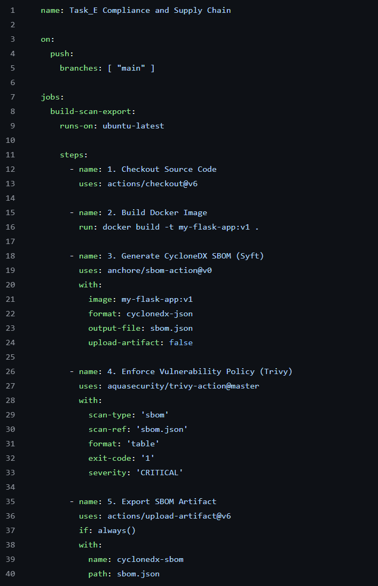

**Note : Each of these steps will be explained in later section.**

---

```python:3.9-slim``` was chosen since it has standard debian and has a image size of around 120MB, which is a sweet spot and functional at the same time. Furthermore, the Dockerfile intentionally avoids executing as the default root user. By running ```groupadd -r securitygroup && useradd -r -g securitygroup appuser```, the build creates a dedicated, low-privilege system user to harden security against tampering and exploits.

- #### Dockerfile_config
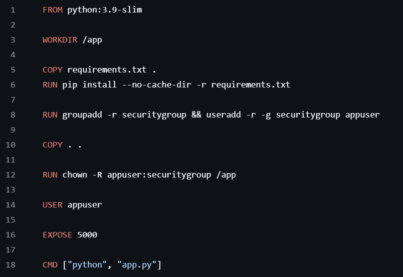

---

Uses the latest flask version.
- #### requirement_file
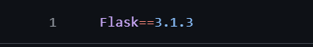

---

This is mainly for the local container built since most of these files are not uploaded to github anyways. 
- #### .dockerignore_config
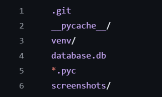

---

Workflow result after pushing. One of them fails, since Trivy found vulnerabilities. 
- #### Workflow_overview
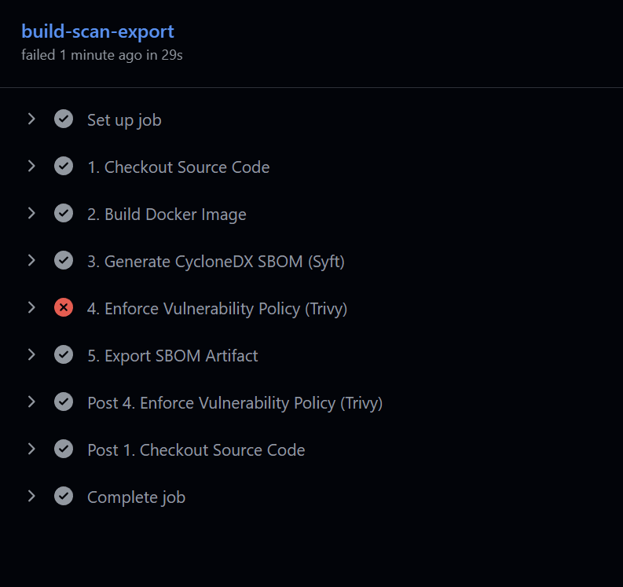

---
Successfully built the container.

- #### Container successfully built
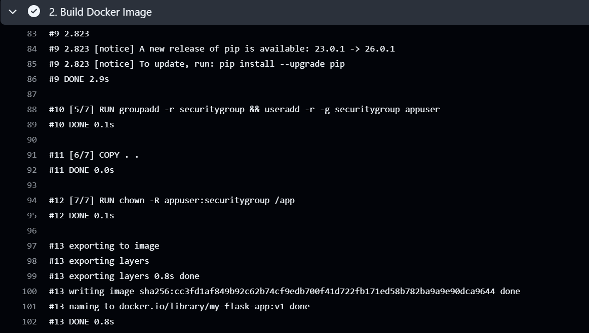

**Combining an automated CI/CD pipeline with a securely scoped, non-root container architecture ensures that the build is tamper-evident and resistant to post-deployment modification which directly satisfies the objectives of PS.1.**

---

## PW.4 - Produce Well-Secured Software

```requirements.txt file``` is just a request for dependencies, it does not guarantee the actual compiled state of the software. To achieve true supply chain transparency, the pipeline utilizes Anchore Syft to inspect the compiled ```my-flask-app:v1``` container layers. The output is explicitly configured as a CycloneDX JSON file. ```upload-artifact: false``` to disable the automatic artifact upload since ```anchore/sbom-action@v0``` auto-generate artifact by default. 

- #### Generate_CycloneDX_SBOM
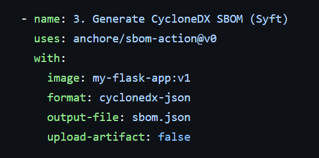

---

We will manually upload the artifact with a proper file name and structure. 

- #### upload_artifact
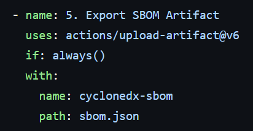

---

Uploaded artifact can be downloaded here. I also attached the downloaded ```sbom.json``` file at the root directory of this ```task_e``` folder.
- #### SBOM_output
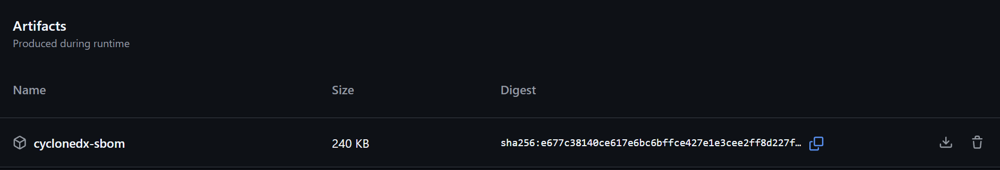

---

Python 3.9 and Flask 3.1.3, can be found in the ```sbom.json``` output, which means it is indeed using my exact specify version, which maintains the strict provenance records required by PW.4.
- #### sbom.json content
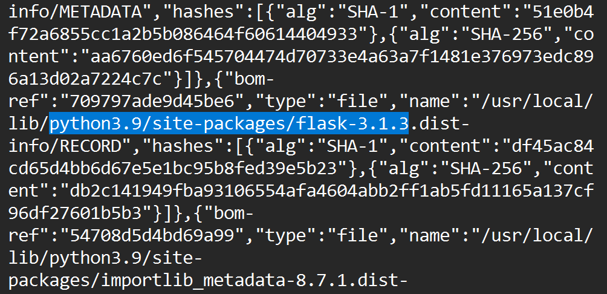

---

## RV.1 - Respond to Vulnerabilities

As mentioned in the previous section, SBOM output is explicitly configured as a CycloneDX JSON instead of a PDF. By explicitly configuring the pipeline to output the artifact using the ```format: cyclonedx-json```, the SBOM is transformed into standardized, machine-readable data. As a result, it allows monitoring tool such as aqua trivy to programmatically ingest this output format.The result will be shown as a table format, ```format: 'table'```, for easier inspection.
  

- #### Enforce Vulnerability Policy
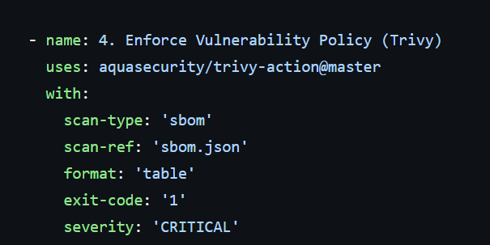

- #### Result
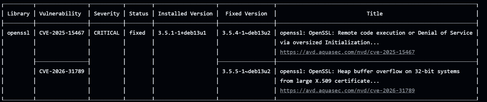

---

## RV.2 - Remediate Vulnerabilities

Identifying a vulnerability provides no security value unless it is followed by immediate remediation. As we can see on [Enforce Vulnerability Policy](#enforce-vulnerability-policy) section , the pipeline is configured so that it has a failure condition if it discovers vulnerability with a ```CRITICAL``` severity.

- #### Failed pipeline
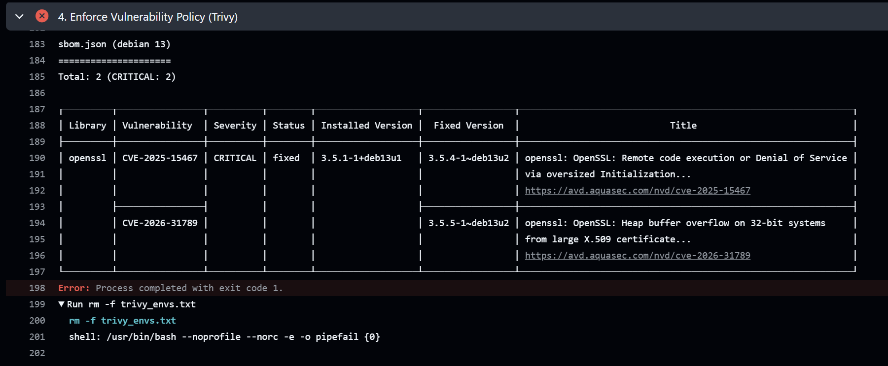

This shows that the pipeline is not just monitoring for vulnerabilities, it automatically fails the pipeline if it found something critical, which fulfils the requirement of RV.2.

---


